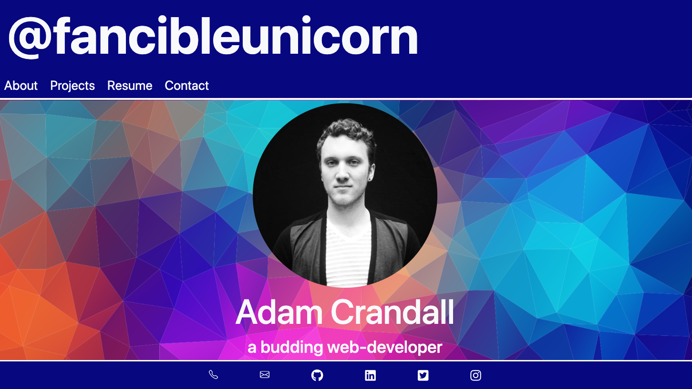

# r-portfolio

  ## Description

 Welcome to my new and improved website, thanks to the magic of React!

 
  
To view the live page:  [Click Here](https://fancibleunicorn.github.io/r-portfolio)

  ## Table of Contents
  
  * [Installation](#installation)
  * [Usage](#usage)
  * [Contributing](#contributing)
  * [Testing](#testing)
  * [License](#license)
  * [Questions](#questions)
  
  ## Installation

  To use this repo on your local machine, you will need Node.js.  After cloning the code to your local device, be sure to run "node npm install" to include essential npm packages.
  
  ## Usage 

On load, the website will show the main landing page.  From here, when you click the varous tabs, the page will generate each section within a single page.  To return to the main page click @fancibleunicorn at the top. Please note the Contact Me section is for demonstation only.  Please use the links to my various accounts in the footer of the page to contact me.

  
  ## Contributing

 Please reach out via email if you wish to contribute (see questions section below)
  
  ## Testing

  No testing currently.
  
  ## License

  
  
  ## Questions
  
  * GitHub: [@fancibleunicorn](https://github.com/fancibleunicorn)
  * Email: adamcrandall91@gmail.com
